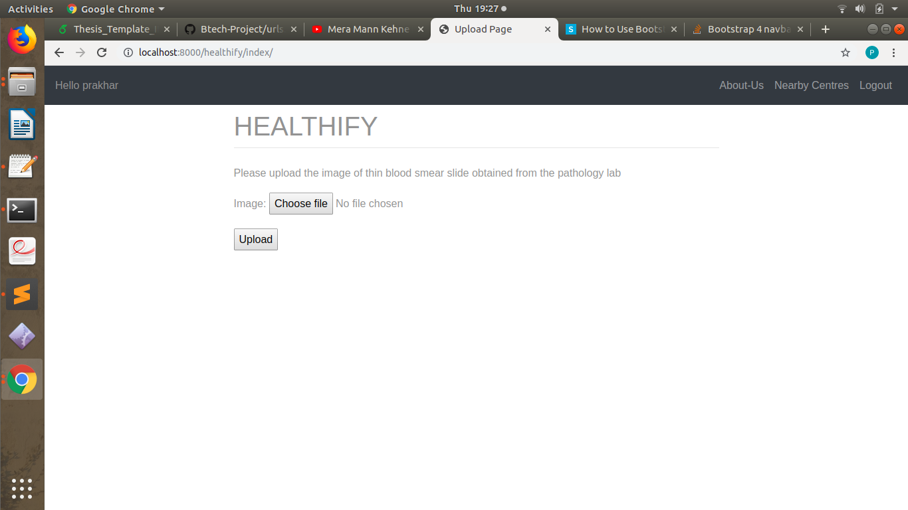
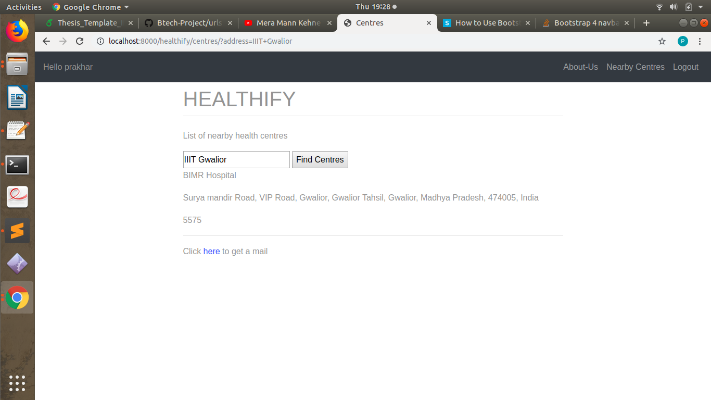
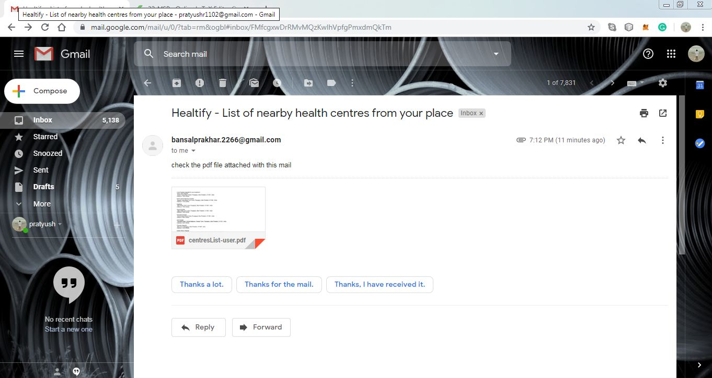

<h2>HEALTHIFY</h2>

An interactive web application made with <b>django backend</b> that detects the presence of malaria in human blood

<h2>Motivation</h2>

There were many projects done in the past on this topic but most of them were mere algorithmic implementation. This project has a more complete output in form of a basic yet powerful web application that can be used even by a naive user.

<h2>Technology Stack used </h2>

  <li>Language Used </li>
    <ul>python</ul>
  <li>Machine learning and Deep learning</li>
    <ul>keras, Scikitlearn, numpy, pandas, opencv etc.</ul>
  <li> Web Technologies</li>
    <ul>Django, HTML, CSS </ul>

<h2>WorkFlow</h2>

<h2>Working Demo </h2>

The user visits the web application. At the home page of the application, the user
is asked to upload the image of the thin blood smear slides.

The user uploads the image and the pre-trained classifier then runs on the image
to provide the result. In case the user is found infected, then he can choose to
view the nearby healthcentres.

The coordinates of the user location is then extracted using the IP address of the
device. The user also has the option to enter his location manually. In case the
user enter his location manually, the address is first converted to the correspond-
ing coordinates using geocoding. The coordinates of the nearby healtcentres are
then obtained by using the google Map API. Finally, these coordinates are con-
verted to readable address using reverse geo-coding.

The user is also given an option to receive the list of nearby health-centres in the
form of PDF as an email.

